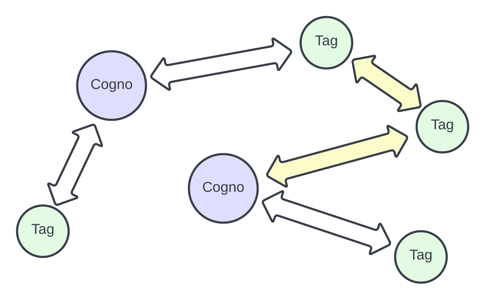
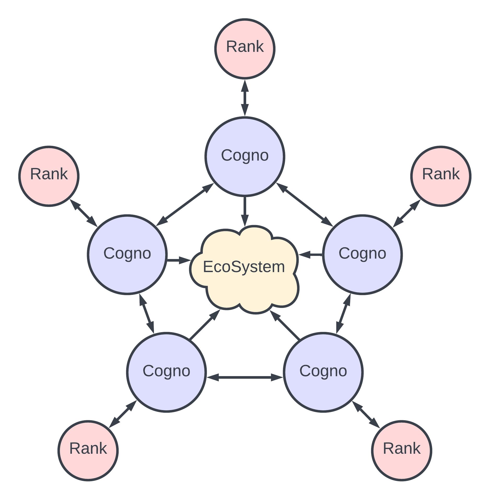

# Cogno

```
cognomen 

Noun

A word or set of words by which a person or thing is known, addressed, or referred to

A familiar, invented given name for a person or thing 

used instead of the actual name of the person or thing
```

A smart contract for UTxO-based cognomens. Each UTxO is a wallet identifier similar to ada handles but instead of NFTs representing the nickname it will be the datum attached to a UTxO inside a smart contract.

## Use

A user is always in control of their cognomen. A user may update or remove their cogno at anytime as long as their public key hash is present inside the transaction. Other users may give kudos to a cogno at any time to show praise for some account. The cogno is designed to hold many familiar social media profile-related data such as contact information or an image for the cogno. There is a minimum ada threshold to use some of the endpoints. This is to ensure there is always enough ada on the UTxO for whatever cogno data may be present and that each cogno has skin in the game via a refundable ada deposit. The minimum value is currently set to 10 ADA for testing.

The primary use case of this contract is for reference. This contract will contain wallet information for some ecosystem within Cardano.

## The basic Cogno

A wallet will create a Cogno by supplying a payment public key hash, a staking credential, and a cognomen. A user may choose to update their Cogno to include a cogno image, some more details about their Cogno, and their locale.


```hs
data CognoData = CognoData
  { cdPkh    :: PlutusV2.PubKeyHash
  -- ^ The public key hash of the cogno.
  , cdSc     :: PlutusV2.PubKeyHash
  -- ^ The stake hash of the cogno.
  , cdKudos  :: Integer
  -- ^ The cogno's global kudos points.
  , cdCogno  :: PlutusV2.BuiltinByteString
  -- ^ The actual cognomen.
  , cdImage  :: [PlutusV2.BuiltinByteString]
  -- ^ The image of the cogno.
  , cdDetail :: [PlutusV2.BuiltinByteString]
  -- ^ The details of the cogno.
  , cdLocale  :: PlutusV2.BuiltinByteString
  -- ^ The cogno's locale.
  }
```

This is all the information required to identify a wallet address with a cognomen.

## Use Case

When a wallet address is queried, the wallet address can be cross reference with datum data from this contract to relay information about that specific wallet. This behaves very similarly to already existing NFT based identification but the key difference is the updatable data and that it can be referenced on-chain. Smart contracts will now have the ability to reference a wallets Cogno and use that data in on-chain validation functions.

# Tag

The tag data structure is designed for displaying and connecting messages on the blockchain. Similarly to the cogno data, a wallet owns the utxo that holds their message. The tag data holds a tag, a short title or label for the post, the details of the post, and if applicable a quote, the txId information of a previous post. 

```hs
data TagData = TagData
  { tPkh    :: PlutusV2.PubKeyHash
  -- ^ The public key hash of the wallet.
  , tSc     :: PlutusV2.PubKeyHash
  -- ^ The stake hash of the wallet.
  , tTag    :: PlutusV2.BuiltinByteString
  -- ^ The tag of the message.
  , tDetail :: [PlutusV2.BuiltinByteString]
  -- ^ The details of the message.
  , tQuoteTxId :: PlutusV2.BuiltinByteString
  -- ^ The TxId of the quote tag.
  , tQuoteIndex :: Integer
  -- ^ The Index of the quote tag.
  }
```
The user may decide to remove the tag after tagging or they may just update an already existing tag with a new message. The message is permanent and available to all on the blockchain.

Another user may see a tag and quote it in their own tag. This type of tag referencing is very similar to commenting to someone elses message on social media. The type of quoting system allows for a direct pointer to the UTxO of a previous tag, allowing for dynamic connections to made while all being referencable on-chain.

Any wallet may make a tag but if a tagger happens to have a Cogno then their data will be connected and the profile will be shown with their post. This allows public profiles to exist while permitting pseudo-anonymous taggers. 

## Use Case

Tagging the chain with messages can work as a social media dApp or as a data aggregation portal for oracles. The key aspect about the tagging system is the cogno connections. On-chain data structures can be linked to off-chain account profiles.



There are many cogno and many tags but the connections between them reveal a wallet profile that can be shown off-chain. The connection displayed above by the yellow arrows indicate a network betwen a cogno, a tag, and a quoted tag. This information may be used to relay the cogno information for a frontend website to use.

# Rank

The rank datas structure provides the means for a Cogno to acquire upvotes and downvotes but applied to a specific rank use case, a rank type. A Cogno may have many rank structures attach to it, providing rank information for many different ecosystems within Cardano. Each rank is connected to a Cogno via the tx hash and index. This means when a Cogno is updated the connected rank datums need to be updated too. 

```hs
data RankData = RankData
  { rPkh        :: PlutusV2.PubKeyHash
  -- ^ The public key hash of the wallet.
  , rSc         :: PlutusV2.PubKeyHash
  -- ^ The stake hash of the wallet.
  , rUpVote     :: Integer
  -- ^ The up rank of the wallet.
  , rDownVote   :: Integer
  -- ^ The down rank of the wallet.
  , rAge        :: Integer
  -- ^ The age of the wallet rank.
  , rCognoTxId  :: PlutusV2.BuiltinByteString
  -- ^ The TxId of the cogno connected to this rank.
  , rCognoIndex :: Integer
  -- ^ The Index of the TxId of the congo connected to this rank.
  , rType       :: Integer
  -- ^ The type of rank the data is representing.
  }
```

The user can always remove a rank from the contract just like a Cogno or tag. The only user-updatable parameter is the Cogno transaction information. The goal is keeping a rank for a long time so trust may be built up. This is why there is an age parameter that should remain constant from the initial value. The up an down voting of a rank is open to all. This will be improved in the future but the basic implementation exists. The rank type is a designation flag for which ecosystem this rank applies too. Many groups may need some form of user ranking so creating a global rank system here just doesn't make sense. This allows for more granular control over one's own Cogno.

## Use Case

A user may have a cogno that represents a profile in some Cardano ecosystem. Within this ecosystem, their exists a ranking system that determines what a user can and can not do inside the ecosystem. This ranking system can be represented by a rank data attached to a Cogno. A positive action may result in an upvote while a negative action may result in a downvote. This may seem fairly restrictive but if an ecosystem requires permission-based smart contract interactions then this type of datum interaction is imperative.




Another use may be attach rank to an arbitrary UTxO, like a tag, in which user may cast an up or down vote. The datum is designed to hold the tx information of just a Cogno but the data is formatted for any tx information so as long as the off-chain handles the referencing correctly it may be used to represent whatever the user wants. In the tag example, it would act like up and down votes on a social media post. The tx that is being referenced can also be from another smart contract, allowing the rank to represent the outcome of a public vote. The possiblities are almost endless.

# Address to PubKeyHash Example

Obtaining the PubKeyHash format for the datum from a base address is rather easy. Assume the wallet address is

```bash
addr1qxvlcxj3fg3jk2dp3kmkxhnx2zuv7edktk5rfy2n9juj3h2m0cw9csycjc4v59ywy7fk8nqfu6qjdzjejhvayfhf8dwsttnjt6
```

then the hash representation is

```bash
0199fc1a514a232b29a18db7635e6650b8cf65b65da83491532cb928dd5b7e1c5c4098962aca148e279363cc09e681268a5995d9d226e93b5d
```

For this example address, the pkh and sc PubKeyHash are

```bash
# pkh PubKeyHash
99fc1a514a232b29a18db7635e6650b8cf65b65da83491532cb928dd

# sc PubKeyHash
5b7e1c5c4098962aca148e279363cc09e681268a5995d9d226e93b5d
```

Essentially, the information needed is obtained by removing the network tag and splitting the resulting string in half of length 56.